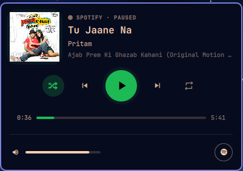

# Omarchy Spotify Player Plugin

A native Spotify status bar widget and interactive player popup for Omarchy and Quickshell.

This plugin interfaces directly with the official Spotify desktop application via MPRIS and D-Bus, providing a minimal status bar indicator and a feature-rich popup player with live seekable timeline, volume controls, shuffle and repeat toggles, high-resolution album artwork, and automatic application launching.



---

## One-Command Installation

Any Omarchy user can install and enable this plugin with a single command:

```bash
omarchy plugin add https://github.com/radheshpai87/omarchy-spotify-player.git --enable
```

---

## Overview

- **Bar Widget**: A minimal Spotify brand icon for the Omarchy status bar. Displays an active indicator when playback is active, and dims when paused or offline.
- **Popup Player**: An interactive card featuring album art with ambient glow, song title, artist and album details, playback controls, an interactive seekable progress bar with timestamps, a volume slider, and one-click Spotify window focus.
- **Offline Resilience**: When Spotify is closed, the popup displays a launch prompt with a single-click action to start the application. Once Spotify is running, the interface automatically detects playback and updates in real time.

---

## Requirements

- **Omarchy Linux** (any version running Hyprland and Omarchy Shell)
- **Quickshell** (included with Omarchy)
- **Spotify Desktop Client** (`spotify` on PATH)
- **Nerd Font** (included with Omarchy for brand and control glyphs)

---

## Manual Installation

1. Clone the repository into your Omarchy plugins directory:

```bash
git clone https://github.com/radheshpai87/omarchy-spotify-player.git ~/.config/omarchy/plugins/omarchy-spotify-player
```

2. Enable the plugin using the Omarchy CLI:

```bash
omarchy plugin enable omarchy-spotify-player
```

---

## Controls and Interaction

### Status Bar Icon

| Action | Result |
| :--- | :--- |
| **Left Click** | Open or close the player popup card |
| **Middle Click** | Toggle Play / Pause |
| **Right Click** | Skip to next track |
| **Scroll Up** | Skip to previous track |
| **Scroll Down** | Skip to next track |
| **Hover** | Display tooltip with current track and artist |

### Popup Card Player

| Control | Description |
| :--- | :--- |
| **Album Art** | Displays current album artwork; click to bring Spotify window to the front |
| **Shuffle** | Toggle shuffle mode on/off with active illumination |
| **Previous** | Skip to previous track or restart current song |
| **Play / Pause** | Primary hero button to toggle playback with hover scaling and outer glow |
| **Next** | Skip to next track |
| **Repeat / Loop** | Cycle repeat modes: Off, Playlist, or Track |
| **Progress Timeline** | Displays elapsed time (e.g., 1:50) and duration (e.g., 5:25); click or drag to seek |
| **Volume Slider** | Adjust playback volume; click volume icon to mute or restore volume |
| **Spotify Icon** | Focuses the Spotify application in Hyprland or launches it if closed |

---

## Configuration

The plugin supports customizable defaults in `~/.config/omarchy/shell.json`:

```json
{
  "id": "omarchy-spotify-player",
  "showTitleInBar": false,
  "maxBarLabelWidth": 220,
  "spotifyGreenAccent": true,
  "enableMarquee": true,
  "enableAnimatedEqualizer": true,
  "hideWhenNoMedia": false
}
```

### Configuration Options

| Option | Type | Default | Description |
| :--- | :--- | :--- | :--- |
| `showTitleInBar` | Boolean | `false` | Display song title text in the status bar alongside the icon |
| `maxBarLabelWidth` | Integer | `220` | Maximum pixel width for the text label in the status bar |
| `spotifyGreenAccent` | Boolean | `true` | Use official Spotify green accent color for active elements |
| `enableMarquee` | Boolean | `true` | Scroll text horizontally when song titles exceed label width |
| `enableAnimatedEqualizer` | Boolean | `true` | Show animated equalizer wave when media is actively playing |
| `hideWhenNoMedia` | Boolean | `false` | Hide the bar icon completely when no media player is detected |

---

## Project Structure

```
omarchy-spotify-player/
├── manifest.json              # Omarchy plugin descriptor and schema
├── BarWidget.qml              # Status bar widget component
├── SpotifyPopup.qml           # Full-featured interactive player popup
├── SpotifyProgressSlider.qml  # Seekable progress bar component
├── SpotifyVolumeSlider.qml    # Interactive volume slider component
├── SpotifyModel.js            # MPRIS discovery, D-Bus commands, and formatting logic
├── README.md                  # Plugin documentation
└── LICENSE                    # MIT License
```

---

## Updating

Users can update the plugin anytime using:

```bash
omarchy plugin update omarchy-spotify-player
```

---

## Validation

You can validate this plugin folder against the Omarchy plugin manifest schema at any time by running:

```bash
omarchy plugin validate ~/.config/omarchy/plugins/omarchy-spotify-player
```

---

## License

This project is licensed under the MIT License. See the [LICENSE](LICENSE) file for details.
